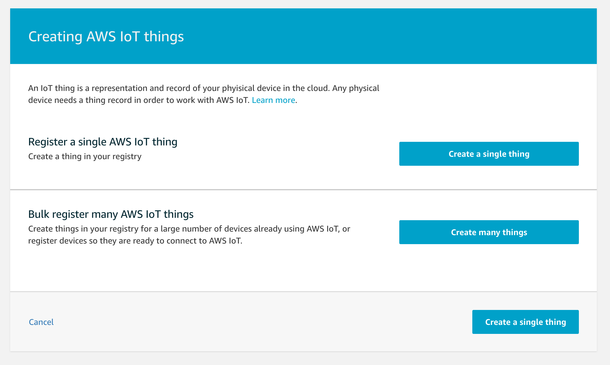
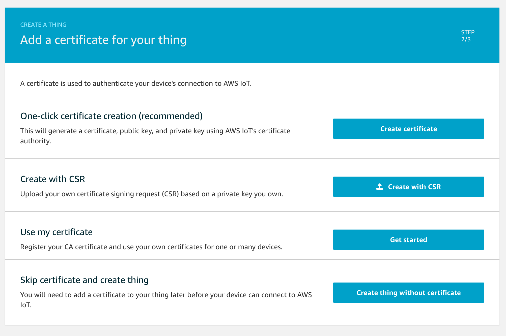
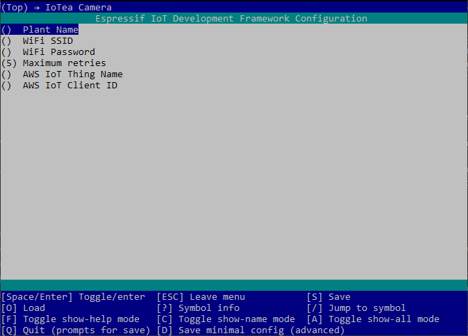
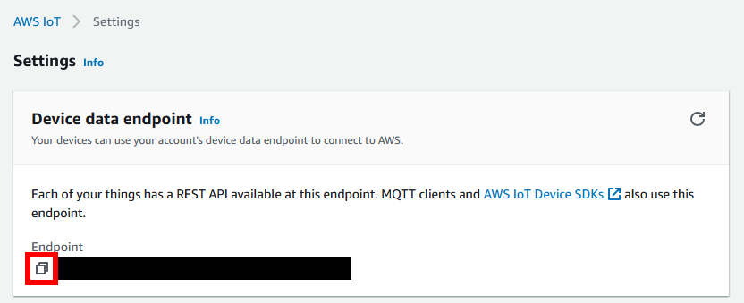
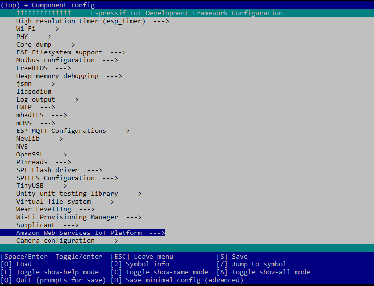
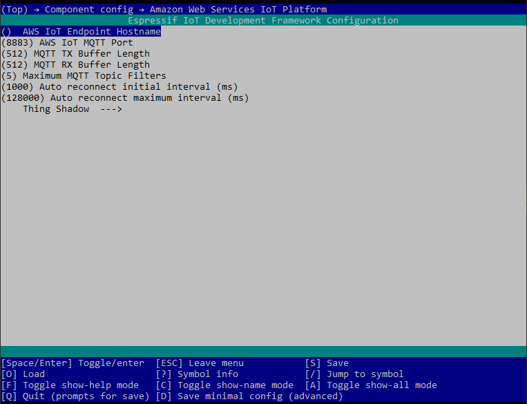

# Prerequisites
* [ESP-IDF](https://github.com/espressif/esp-idf)
* [Espressif build tools](https://docs.espressif.com/projects/esp-idf/en/latest/esp32/get-started/)
* [ESP-EYE](https://www.espressif.com/en/products/devkits/esp-eye/overview) development board
* AWS account with [IoT Core](https://aws.amazon.com/iot-core/)

### ESP-IDF and espressif tooling
The Espressif [getting started guide](https://docs.espressif.com/projects/esp-idf/en/latest/esp32/get-started/) is recommended as it provides a guide for installing ESP-IDF and the build tools. It will walk you through building and flashing a project to your device. Once completing the guide you will have all the required tooling to build and flash this project.

### Required components
Make sure you have the [esp32-camera driver](https://github.com/espressif/esp32-camera) repository and the [esp-aws-iot](https://github.com/espressif/esp-aws-iot) repository in the component folder. You can clone these by running `git submodule init` and then `git submodule update --recursive`. This will clone the latest drivers from their repo into the components folder for you. 

### AWS certs
You will need to create an AWS IoT thing for your device and download your certificates to be embedded onto the board. To do this log into your [AWS console](https://console.aws.amazon.com/) and open the AWS IoT Core service. Open the "Things" section within the "Manage" menu. Create a new thing. Use the "Create a single thing option".

Choose the "One-click certificate creation" option.

Once the certs have been created, download all three of them and add an AWS policy. We do not use the public key but this should be saved somewhere safe. Move the cert and the private key to `main/certs`. Rename them by removing the device specific numbers at the beginning. They should be named:
* `certificate.pem.crt`
* `private.pem.key`

We need to add the AWS Root CA as well. This can be downloaded from [this link](https://www.amazontrust.com/repository/AmazonRootCA1.pem). Save this to `main/certs` as `aws-root-ca.pem`

 

Once you have completed these steps you can build and flash the program onto the board.

 

# Building/Flashing
Run the espressif tooling and navigate to the iotea-camera directory. From there run the following commands.
1. Run `idf.py set-target esp32` This only needs to be run once after cloning
2. Run `idf.py menuconfig` To set the config options for the project. 
    1. **Set config values:** 
        * Navigate into the **IoTea Camera** menu.
        
        * Enter your WiFi settings (SSID and password) to allow the board to access the internet and enter your AWS info (name of thing and client ID).
        
    2. **Enable PSRAM:** 
        * Navigate into the **Component config** menu.
        
        * Navigate into the **ESP32 specific** menu.
        
        * Enable **Support for external, SPI-connected RAM**.
          
    3. **Add AWS hostname:**
        * In your AWS IoT Core console, click on "Settings" in the bottom left.
        * Copy the custom endpoint.
        
        * Navigate into the **Component config** menu.
        
        * Scroll down and navigate into the **Amazon Web Services IoT Platform** menu.
        
        * Paste the custom endpoint that you copied into the **AWS IoT Endpoint Hostname** option.
        
3. Run `idf.py build` to build the entire project and required components.
4. Run `idf.py -p PORT flash` to flash the build project onto the board. Replace PORT with the serial port the board is connected to. The serial ports will have the following patterns in their names:
    * Windows: names like `COM1`
    * Linux: starting with `/dev/tty`
    * macOS: starting with `/dev/cu`
5. To monitor the board while connected run `idf.py -p PORT monitor`

Once you have successfully built the entire project you can specifically rebuild just the app by running `idf.py app`. The corresponding flash command is `idf.py -p PORT app-flash`

You can chain commands by adding multiple arguments to `idf.py` for example to flash and then monitor the app you could run `idf.py -p PORT flash monitor`