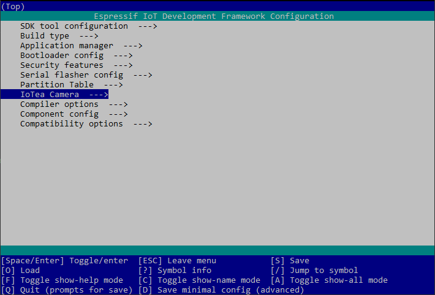
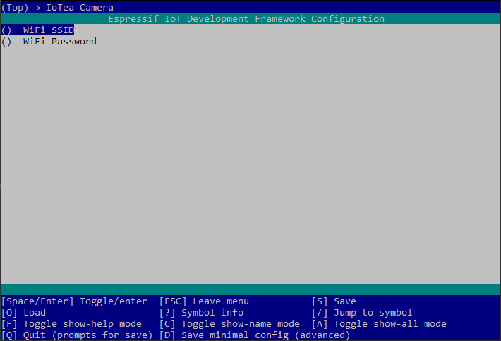
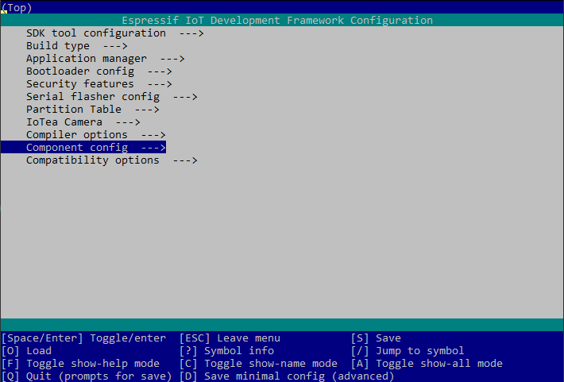
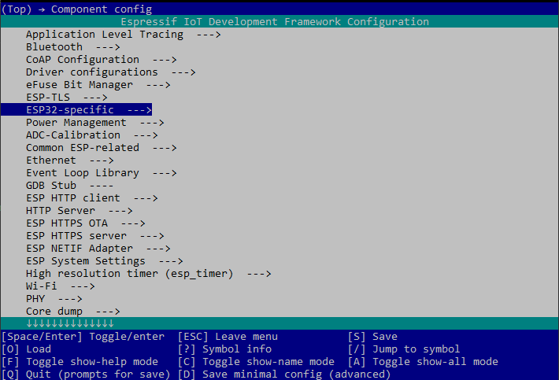
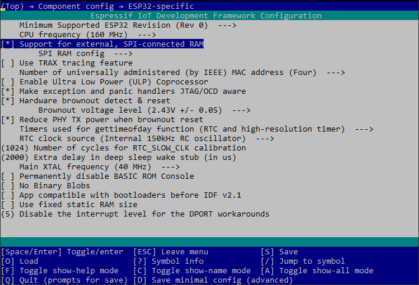

# Prerequisites
* [ESP-IDF](https://github.com/espressif/esp-idf)
* [Espressif build tools](https://docs.espressif.com/projects/esp-idf/en/latest/esp32/get-started/)
* [ESP-EYE](https://www.espressif.com/en/products/devkits/esp-eye/overview) development board
* AWS account with [IoT Core](https://aws.amazon.com/iot-core/)

The Espressif [getting started guide](https://docs.espressif.com/projects/esp-idf/en/latest/esp32/get-started/) is recommended as it provides a nice walkthrough to install ESP-IDF and the build tools. It will walk you through building and flashing a project to your device. Once completing the guide you will have all the required tooling to build and flash this project.

# Building/Flashing
Make sure you have the [esp32-camera driver](https://github.com/espressif/esp32-camera) repository in the component folder. You can clone this by running running `git submodule init` and then `git submodule update`. This will clone the latest esp32-camera driver from the repo into the components library for you. 

Once this is completed run the following commands ensuring the board is connected.

1. Run `idf.py set-target esp32` This only needs to be run once after cloning
2. Run `idf.py menuconfig` To set the config options for the project. 
    1. **Enable WiFi:** 
        * Navigate into the **IoTea Camera** menu.
        
        * Enter your WiFi settings (SSID and password) to allow the board to access the internet.
        
    2. **Enable PSRAM:** 
        * Navigate into the **Component config** menu.
        
        * Navigate into the **ESP32 specific** menu.
        
        * Enable **Support for external, SPI-connected RAM**.
          
3. Run `idf.py build` to build the entire project and required components.
4. Run `idf.py -p PORT flash` to flash the build project onto the board. Replace PORT with the serial port the board is connected to. The serial ports will have the following patterns in their names:
    * Windows: names like `COM1`
    * Linux: starting with `/dev/tty`
    * macOS: starting with `/dev/cu`
5. To monitor the board while connected run `idf.py -p PORT monitor`

Once you have successfully built the entire project you can specifically rebuild just the app by running `idf.py app`. The corresponding flash command is `idf.py -p PORT app-flash`

You can chain commands by adding multiple arguments to `idf.py` for example to flash and then monitor the app you could run `idf.py -p PORT flash monitor`